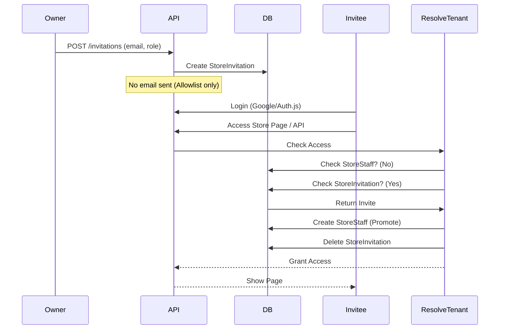

# Authentication & Store Admin Invitation Flow

This document outlines the current authentication system and the specific flow for inviting and adding store administrators.

## 1. Authentication System

The application uses **Auth.js (NextAuth)** for authentication, integrated with **Prisma** for database persistence.

### Providers
- **Google**: Primary authentication provider.
- **Instagram**: Secondary provider.
- **Credentials**: Enabled only in development (`NODE_ENV !== 'production'`) for testing purposes.

### Data Models
- **User**: The central identity record. Created automatically upon first login via OAuth providers.
- **Account**: Links external OAuth provider details (access tokens, refresh tokens) to the User.
- **Session**: Manages database sessions.

### Security
- **RBAC**: Access is controlled via `StoreRole` enum (`OWNER`, `MANAGER`, `SUPPORT`).
- **Tenant Isolation**: Data access is scoped to `storeId` via `resolveTenant` logic.

---

## 2. Store Admin Invitation Flow

The system currently uses a **Passive Allowlist** model rather than an active "link-based" invitation system. There are no emails sent by the application itself during this process.

### Step 1: Owner Invitation (The "Allowlist")
1.  **Action**: A Store Owner opens the "Add Member" dialog in the Staff Management page.
2.  **Input**: Enters the invitee's **Email Address** and selects a **Role** (e.g., Manager, Support).
3.  **API Call**: The frontend calls `POST /api/admin/staff/invitations`.
4.  **Backend Processing** (`services/storestaff.service.ts`):
    -   Verifies the requestor is an `OWNER`.
    -   Checks if the user is already a member (prevents duplicates).
    -   Creates a record in the `StoreInvitation` table with the `storeId`, `email`, and `role`.
    -   **Note**: No email is sent to the user. The owner must communicate to the user that they have been given access.

### Step 2: User Acceptance (Login & Access)
1.  **Action**: The invited user logs in to the application (e.g., using "Sign in with Google" with the invited email address).
2.  **Tenant Resolution**:
    -   When the user attempts to access store-specific resources (API or Page), the `resolveTenant` function (`lib/tenant/resolveTenant.ts`) is triggered.
    -   This function determines if the user has access to the requested `storeId`.
3.  **Automatic Acceptance**:
    -   If the user is **not** currently a staff member of the store...
    -   The system checks the `StoreInvitation` table for a pending invite matching the user's `email` and the `storeId`.
    -   **If a match is found**:
        1.  The system automatically creates a `StoreStaff` record, linking the `User` and `Store` with the assigned role.
        2.  The `StoreInvitation` record is deleted.
        3.  Access is granted immediately.

### Summary Diagram

## 3. Key Files

-   **Schema**: `prisma/schema.prisma` (`StoreInvitation`, `StoreStaff`, `User`).
-   **Service**: `services/storestaff.service.ts` (Handles `inviteStaff` and `acceptInvitation` logic).
-   **Tenant Resolution**: `lib/tenant/resolveTenant.ts` (Triggers `acceptInvitation` on access).
-   **API Route**: `app/api/admin/staff/invitations/route.ts` (Endpoint for creating invites).
