# Storefront Builder V2 — UI Design Specification

> Implementation-grade spec grounded in the existing codebase.
> Assumes Next.js 14 + React 18 + TypeScript + shadcn/ui + Zustand + dnd-kit.

---

## A) Information Architecture

### Current Layout (V1)

```
┌─ TopBar ──────────────────────────────────────────────────────────┐
│ docName │ device │ mode │ undo/redo │ save │ publish │ generate   │
├──────────┬────────────────────────────────┬─────────────────────── │
│ Left     │ Canvas                         │ Right (Inspector)     │
│ ├ Palette│                                │ ├ Design tab          │
│ └ Layers │                                │ ├ Content tab         │
│          │                                │ └ Data tab            │
└──────────┴────────────────────────────────┴───────────────────────┘
```

### V2 Layout

```
┌─ TopBar ──────────────────────────────────────────────────────────────────────┐
│ docSwitcher │ pageTitle │ device │ mode │ routePreview │ undo/redo │ save │ ▾ │
├──────────┬─────────────────────────────────┬──────────────────────────────────┤
│ Left     │ Canvas                          │ Right                            │
│ ├ Pages  │ (+ overlay: SelectionOutline,   │ ├ Properties tab                 │
│ ├ Palette│    SnapLines, DropZones,        │ ├ Style tab                      │
│ ├ Layers │    HoverHighlight)              │ ├ Bindings tab                   │
│ └ Data   │                                 │ ├ Actions tab                    │
│          │                                 │ └ Children tab                   │
├──────────┴─────────────────────────────────┴──────────────────────────────────┤
│ Bottom Bar                                                                    │
│ ├ Problems (0)  │ Console (0)  │ Publish Status  │  Breadcrumb                │
└───────────────────────────────────────────────────────────────────────────────┘
```

Key structural changes:
1. **Left sidebar gains two new tabs**: "Pages" (document/route manager) and "Data" (data profile config).
2. **Inspector right tabs reorganized**: separate tabs for Properties, Style, Bindings, Actions, Children.
3. **Bottom bar added**: Problems panel (validation), console/logs, publish status, breadcrumb (moved from canvas overlay).
4. **TopBar gains**: Document switcher dropdown, route preview input, publish menu (dropdown replacing single button).

### Navigation Hierarchy

```
Left Sidebar Tabs (icons only, tooltip labels):
  📄 Pages      — manage documents, routes, data profiles
  🧩 Components — palette (drag to canvas)
  🗂 Layers     — tree view of current document
  📊 Data       — data profile viewer + route params

Right Inspector Tabs (text labels):
  Properties  — props editor (schema-driven)
  Style       — token picker + responsive overrides
  Bindings    — AST binding editor
  Actions     — pipeline editor
  Children    — child ordering + slot management

Bottom Bar Tabs:
  Problems    — validation issues (badge count)
  Console     — action logs + binding evaluation trace
  Publish     — snapshot history + environment status
```

---

## B) Component Inventory

### B.1 — Top-Level Layout

| Component | File | Responsibility |
|---|---|---|
| `EditorLayout` | `EditorLayout.tsx` | **MODIFY** — add bottom bar, restructure sidebar tabs |
| `TopBar` | `TopBar.tsx` | **MODIFY** — add doc switcher, route preview, publish dropdown |
| `BottomBar` | `BottomBar.tsx` | **NEW** — hosts Problems, Console, Publish tabs |

### B.2 — Left Sidebar: Pages Tab

| Component | File | Responsibility |
|---|---|---|
| `PagesPanel` | `PagesPanel.tsx` | **NEW** — Document list grouped by kind (Pages, Templates, Layouts, Prefabs) |
| `PageItem` | `PagesPanel.tsx` | **NEW** — Single document row: name, kind icon, status badge, route |
| `CreatePageDialog` | `CreatePageDialog.tsx` | **NEW** — New page form (kind, key, optional clone-from) |
| `RouteManifestEditor` | `RouteManifestEditor.tsx` | **NEW** — Route list with drag-reorder, precedence numbers, conflict badges |
| `RouteEntryRow` | `RouteManifestEditor.tsx` | **NEW** — Single route: kind, pattern/path, linked page, data profile, test button |
| `RouteTestDialog` | `RouteTestDialog.tsx` | **NEW** — "Test URL" resolver: input URL → shows matched route + params + data profile |
| `DataProfilePicker` | `DataProfilePicker.tsx` | **NEW** — Dropdown to assign a data profile to a page |
| `DataProfileEditor` | `DataProfileEditor.tsx` | **NEW** — Configure sources inside a data profile (contextKey, params, pageSize) |

### B.3 — Left Sidebar: Data Tab

| Component | File | Responsibility |
|---|---|---|
| `DataPanel` | `DataPanel.tsx` | **NEW** — Shows active data profile, route params, context tree (live preview) |
| `ContextTreeViewer` | `ContextTreeViewer.tsx` | **NEW** — Collapsible tree viewer for the runtime context (store, cart, product, collection, etc.) |
| `DataSourcePreview` | `DataSourcePreview.tsx` | **NEW** — Fetch + display sample data for each data source in the profile |

### B.4 — Left Sidebar: Existing (Modified)

| Component | File | Responsibility |
|---|---|---|
| `ComponentPalette` | `ComponentPalette.tsx` | **MINOR MODIFY** — add "Prefabs" section at bottom, "Update Available" badges |
| `LayerTree` | `LayerTree.tsx` | **MODIFY** — add multi-select, visibility toggle, lock toggle, context menu |

### B.5 — Right Inspector: Properties Tab

| Component | File | Responsibility |
|---|---|---|
| `PropertiesPanel` | `Inspector.tsx` | **MODIFY** — extract to own file, keep schema-driven controls |

### B.6 — Right Inspector: Style Tab (Redesigned)

| Component | File | Responsibility |
|---|---|---|
| `StylePanel` | `StylePanel.tsx` | **NEW** (replaces `StylesPanel`) — token-first + responsive |
| `TokenPicker` | `TokenPicker.tsx` | **NEW** — Modal/popover: browse tokens by category (colors, spacing, typography, radii, shadows) |
| `TokenSwatch` | `TokenPicker.tsx` | **NEW** — Single token: name, preview swatch, value |
| `ResponsiveTabs` | `StylePanel.tsx` | **NEW** — Breakpoint tabs (base/sm/md/lg/xl) with active indicator |
| `OverrideInput` | `StylePanel.tsx` | **NEW** — CSS property input with "uses token" badge + "detach" button |
| `StyleValidationBadge` | `StylePanel.tsx` | **NEW** — Shows if a token ref is missing/invalid |

### B.7 — Right Inspector: Bindings Tab (Redesigned)

| Component | File | Responsibility |
|---|---|---|
| `BindingEditor` | `BindingEditor.tsx` | **NEW** (replaces `BindingsPanel`) — full AST expression builder |
| `BindingExprNode` | `BindingExprNode.tsx` | **NEW** — Recursive renderer for a `BindingExpr` AST node |
| `ContextPathPicker` | `ContextPathPicker.tsx` | **NEW** — Tree-based autocomplete for context paths (store.name, cart.items.0.title, etc.) |
| `TransformPicker` | `BindingEditor.tsx` | **NEW** — Dropdown of registered transforms with param inputs |
| `BindingPreview` | `BindingEditor.tsx` | **NEW** — Live evaluation result using current preview context |
| `RepeaterScopeIndicator` | `BindingEditor.tsx` | **NEW** — Shows `item` and `index` when inside a Repeater ancestor |

### B.8 — Right Inspector: Actions Tab (Redesigned)

| Component | File | Responsibility |
|---|---|---|
| `PipelineEditor` | `PipelineEditor.tsx` | **NEW** (replaces `ActionsPanel`) — full pipeline editor per event slot |
| `PipelineStepCard` | `PipelineEditor.tsx` | **NEW** — Single step: action picker, payload config, condition, drag handle |
| `StepConditionEditor` | `PipelineEditor.tsx` | **NEW** — Uses `BindingExprNode` for step conditions |
| `PayloadBindingRow` | `PipelineEditor.tsx` | **NEW** — Payload field with static/bound toggle + binding editor |
| `ErrorStrategyPicker` | `PipelineEditor.tsx` | **NEW** — Pipeline-level `onError` selector (stop/continue/rollback) |
| `ActionTestRunner` | `ActionTestDialog.tsx` | **NEW** — Execute pipeline in preview context + show results |
| `ActionLogViewer` | `ActionLogViewer.tsx` | **NEW** — Step-by-step execution log (in bottom bar Console tab) |

### B.9 — Bottom Bar

| Component | File | Responsibility |
|---|---|---|
| `BottomBar` | `BottomBar.tsx` | **NEW** — Tabbed bottom panel (collapsible, default collapsed) |
| `ProblemsPanel` | `ProblemsPanel.tsx` | **NEW** — Validation issues list from `publish-validator.ts` |
| `ProblemRow` | `ProblemsPanel.tsx` | **NEW** — Single issue: icon (error/warning), message, node link, fix suggestion |
| `ConsolePanel` | `ConsolePanel.tsx` | **NEW** — Action logs, binding traces, runtime errors |
| `PublishPanel` | `PublishPanel.tsx` | **NEW** — Snapshot history, environment status, rollback controls |
| `SnapshotRow` | `PublishPanel.tsx` | **NEW** — Single snapshot: date, environment, doc count, restore button |

### B.10 — Canvas Overlays

| Component | File | Responsibility |
|---|---|---|
| `SelectionOutline` | `Canvas.tsx` | **EXISTS** — keep, add multi-select support |
| `HoverHighlight` | `Canvas.tsx` | **EXISTS** — keep |
| `DropZones` | `Canvas.tsx` | **EXISTS** — modify to show constraint-aware allowed zones |
| `ErrorOverlay` | `ErrorOverlay.tsx` | **NEW** — Red dotted border on nodes with broken bindings/invalid tokens |
| `RouteSimulator` | `RouteSimulator.tsx` | **NEW** — Floating input in TopBar: type URL → resolves route → loads preview data |

### B.11 — Prefab UX

| Component | File | Responsibility |
|---|---|---|
| `PrefabManager` | `PrefabManager.tsx` | **NEW** — List prefabs with versions, "Create from selection", import/export |
| `PrefabInstanceInspector` | `PrefabInstanceInspector.tsx` | **NEW** — Shows version lock, update available, slot overrides, "Detach" button |
| `SlotOverrideEditor` | `PrefabInstanceInspector.tsx` | **NEW** — Per-slot override: allowed props, styles, bindings |

### B.12 — Dialogs & Modals

| Component | File | Responsibility |
|---|---|---|
| `PublishDialog` | `PublishDialog.tsx` | **NEW** — Environment picker (draft→staged→published), validation gate, confirm |
| `RollbackDialog` | `RollbackDialog.tsx` | **NEW** — Shows diff vs current, confirm restore |
| `KeyboardShortcutsDialog` | `KeyboardShortcutsDialog.tsx` | **NEW** — `?` shortcut opens cheatsheet |

---

## C) State Model

### C.1 — Store Inventory

| Store | Location | Scope | Contents |
|---|---|---|---|
| `useEditorStore` | `editor-store.ts` | **MODIFY** | Tree, selection, history, mode, device, clipboard, zoom/pan |
| `useDocumentStore` | `document-store.ts` | **NEW** | Document list, active document ID, route manifest, data profiles, prefab registry |
| `useValidationStore` | `validation-store.ts` | **NEW** | Validation results, issue list, auto-refresh on tree change |
| `usePublishStore` | `publish-store.ts` | **NEW** | Snapshots, current environment status, publish progress |
| `usePreviewStore` | `preview-store.ts` | **NEW** | Preview route, preview params, resolved data, action logs |

### C.2 — Store Boundaries

```mermaid
graph LR
    subgraph EditorStore["useEditorStore (existing)"]
        tree["tree: StorefrontNode"]
        selection["selection: { nodeId, childNodeId }"]
        history["history: HistoryEntry[]"]
        mode["mode: edit | preview"]
        clipboard["clipboard: StorefrontNode | null"]
    end

    subgraph DocumentStore["useDocumentStore (new)"]
        docs["documents: DocumentMeta[]"]
        activeDoc["activeDocId: string"]
        routes["routeManifest: RouteManifest"]
        profiles["dataProfiles: Record<string, DataProfile>"]
        prefabs["prefabDefinitions: PrefabDefinition[]"]
    end

    subgraph ValidationStore["useValidationStore (new)"]
        result["validationResult: ValidationResult"]
        issues["issues: ValidationIssue[]"]
        autoRun["autoValidateEnabled: boolean"]
    end

    subgraph PublishStore["usePublishStore (new)"]
        snapshots["snapshots: PublishSnapshot[]"]
        envStatus["environments: { draft, staged, published }"]
        inProgress["publishInProgress: boolean"]
    end

    subgraph PreviewStore["usePreviewStore (new)"]
        previewUrl["previewUrl: string"]
        resolvedRoute["resolvedRoute: ResolvedRoute | null"]
        contextData["contextData: Record<string, unknown>"]
        actionLogs["actionLogs: ActionLogEntry[]"]
    end

    EditorStore -->|tree changes| ValidationStore
    DocumentStore -->|active doc| EditorStore
    DocumentStore -->|route manifest| PreviewStore
    PublishStore -->|reads| DocumentStore
    PublishStore -->|reads| ValidationStore
```



### C.3 — Key State Flows

**Switching Documents:**
```
DocumentStore.setActiveDoc(id) →
  fetch document from API →
  EditorStore.loadDocument(id, kind, key, tree) →
  ValidationStore.runValidation(tree) →
  PreviewStore.clearActionLogs()
```

**Auto-Validation on Tree Change:**
```
EditorStore tree changes (via immer subscriber) →
  debounce(300ms) →
  validateDocument(tree, theme) →
  ValidationStore.setResult(result)
```

**Route Preview:**
```
PreviewStore.setPreviewUrl(url) →
  resolveRedirect(manifest, url) OR resolveRoute(manifest, url) →
  if matched: loadDataProfile(profile, params, executor) →
  PreviewStore.setContextData(data) →
  Canvas re-renders with new context
```

---

## D) Event Flows

### D.1 — Create Page → Assign Route → Assign Data Profile → Publish

```
1. User clicks "+" in PagesPanel
2. CreatePageDialog opens: user enters name, selects kind (PAGE), clicks "Create"
3. → API: POST /api/admin/storefront/documents { kind, key, tree: defaultTree }
4. → DocumentStore.addDocument(newDoc)
5. → EditorStore.loadDocument(newDoc.id, ...)
6. User switches to RouteManifestEditor tab in PagesPanel
7. Clicks "+ Add Route", selects "Static", enters path "/sale"
8. Links to the new page via "Page" dropdown
9. → DocumentStore.updateRouteManifest(updatedManifest)
10. User opens DataProfilePicker on the route row, selects "Collection by Tag"
11. DataProfileEditor appears: user enters tag "sale", pageSize 24
12. → DocumentStore.updateDataProfile(profileId, updatedProfile)
13. User designs the page in Canvas
14. Clicks "Publish ▾" in TopBar → PublishDialog opens
15. ValidationStore.runValidation() — publish gate check
16. If errors: dialog shows error list, publish blocked
17. If clean: user selects "Published", clicks "Confirm"
18. → API: POST /api/admin/storefront/publish { storeId, environment: 'published' }
19. → PublishStore.addSnapshot(newSnapshot)
20. Toast: "Published successfully"
```

### D.2 — Add Product Grid → Bind → Style → Action → Preview → Publish

```
1. User drags "ProductGrid" from ComponentPalette into Canvas
2. → EditorStore.insertNode(parentId, productGridNode, index)
3. User selects the grid, opens Bindings tab
4. Clicks "+" on "items" prop → ContextPathPicker opens
5. Navigates: collection → products → selects path
6. BindingEditor creates: { kind: 'path', root: 'collection', segments: ['products'] }
7. → EditorStore.updateNode(nodeId, { bindingMap: { items: expr } })
8. User opens Style tab, clicks "Background Color" → TokenPicker opens
9. Browses colors category, selects "surface.card"
10. → EditorStore.updateNode(nodeId, { styleTokens: { backgroundColor: 'colors.surface.card' } })
11. User switches to "md" breakpoint tab, changes padding to "spacing.lg"
12. User opens Actions tab, event slot "onItemClick"
13. Clicks "+ Add Step", selects "navigate" action
14. Opens PayloadBindingRow for "url", binds to: { kind: 'transform', transformId: 'template', input: { kind: 'path', root: 'item', segments: ['handle'] }, params: { template: '/products/{value}' } }
15. User clicks route preview input in TopBar, types "/collections/sale"
16. → PreviewStore resolves route → loads collection data → Canvas re-renders with real data
17. User verifies grid looks correct
18. Clicks "Publish ▾" → same flow as D.1 steps 14-20
```

### D.3 — Broken Binding → Fix → Validator Clears

```
1. Theme update removes token "colors.accent" → user saves theme
2. Auto-validation fires on tree:
   - publish-validator scans all nodes
   - Finds node "hero-title" styleTokens.color = "colors.accent" → token missing
3. → ValidationStore issues: [{ level: 'warning', code: 'INVALID_TOKEN_REF', nodeId: 'hero-title', message: '...' }]
4. Bottom bar "Problems" badge shows "(1)"
5. User clicks the problem row
6. → EditorStore.select('hero-title') — node selected on canvas
7. → Inspector opens Style tab automatically
8. StyleValidationBadge shows: ⚠️ "colors.accent" not found
9. User clicks TokenPicker, selects "colors.primary" as replacement
10. → EditorStore.updateNode('hero-title', { styleTokens: { color: 'colors.primary' } })
11. Auto-validation re-runs → no issues found
12. → ValidationStore.setResult({ valid: true, errors: [], ... })
13. Problems badge clears to "(0)"
```

---

## E) Framer-Like UX Details

### E.1 — Selection & Multi-Select

| Behavior | Implementation |
|---|---|
| Click node on canvas | `EditorStore.select(nodeId)` — blue outline, 1px |
| Shift+Click | Add to multi-selection set (`EditorStore.toggleMultiSelect(nodeId)`) |
| Cmd+A | Select all children of current parent |
| Click empty canvas area | Deselect all |
| Double-click text node | Enter inline edit mode (`InlineTextEditor`) |
| Right-click node | Context menu: Copy, Cut, Paste, Duplicate, Delete, Wrap in..., Extract Prefab |

### E.2 — Hover & Outlines

| Object | Style |
|---|---|
| Hover (not selected) | `outline: 1px dashed var(--blue-400)`, label tooltip with component type |
| Selected | `outline: 2px solid var(--blue-500)` + resize handles (corners + edges) |
| Multi-selected | `outline: 2px solid var(--blue-300)` (lighter) |
| Drop target (valid) | `outline: 2px dashed var(--green-500)` + blue insertion line |
| Drop target (invalid) | `outline: 2px dashed var(--red-400)` + constraint tooltip |
| Error node | `outline: 2px dotted var(--red-500)` (from ErrorOverlay) |
| Locked node | Small lock icon badge, no selection on click, ghost cursor |

### E.3 — Snapping & Guides

Current `snapping.ts` supports edge and center snapping. V2 additions:
- **Smart spacing**: When moving between siblings, snap to equal spacing
- **Parent padding snap**: Snap to parent's padding edges
- **Grid snap mode**: Toggle-able 8px grid (`Ctrl+;` to toggle)
- **User guides**: Draggable guide lines from rulers (`EditorMeta.guides`)
- **Snap indicator**: Pink dimension labels showing distance (like Figma)

### E.4 — Drag & Drop

| Action | Source | Target | Behavior |
|---|---|---|---|
| Palette → Canvas | `ComponentPalette` | Canvas drop zone | Insert new node at drop position |
| Layer → Layer | `LayerTree` | `LayerTree` | Move node (reorder/reparent) with constraint checks |
| Canvas → Canvas | Selected node | Drop zone | Move node with snap lines |
| Prefab → Canvas | `PrefabManager` | Canvas | Insert `PrefabInstance` node |
| Step → Step | `PipelineStepCard` | `PipelineEditor` | Reorder pipeline steps (vertical sortable list) |
| Route → Route | `RouteEntryRow` | `RouteManifestEditor` | Reorder route precedence |

### E.5 — Layer Tree Behaviors

| Feature | Behavior |
|---|---|
| Expand/collapse | Arrow toggle on container nodes |
| Rename | Double-click label → inline edit → updates `node.props.label` or node display name |
| Visibility toggle | Eye icon → toggles `node.hidden` |
| Lock toggle | Lock icon → toggles `editorMeta.annotations[nodeId].locked` |
| Drag indicator | Indentation line shows target parent + position |
| Scroll to selected | When selecting on canvas, layer tree auto-scrolls to the item |
| Dimmed locked/hidden | Reduced opacity + strikethrough for hidden nodes |
| Badge icons | 🔗 if has bindings, ⚡ if has actions, ⚠️ if has validation errors |

---

## F) Accessibility & Keyboard Shortcuts

### F.1 — Keyboard Shortcuts (extends existing `keyboard.ts`)

| Shortcut | Action | Category | Existing? |
|---|---|---|---|
| `Ctrl+Z` / `⌘+Z` | Undo | History | ✅ |
| `Ctrl+Y` / `⌘+⇧+Z` | Redo | History | ✅ |
| `Ctrl+C` / `⌘+C` | Copy node | Clipboard | ✅ |
| `Ctrl+X` / `⌘+X` | Cut node | Clipboard | ✅ |
| `Ctrl+V` / `⌘+V` | Paste node | Clipboard | ✅ |
| `Delete` / `Backspace` | Delete selected | Editing | ✅ |
| `Escape` | Deselect / close dialog | Navigation | ✅ |
| `↑` / `↓` | Navigate siblings | Navigation | ✅ |
| `←` | Select parent | Navigation | ✅ |
| `→` | Select first child | Navigation | ✅ |
| `Ctrl+S` / `⌘+S` | Save | Document | ✅ |
| `Ctrl+D` / `⌘+D` | Duplicate selected | Editing | **NEW** |
| `Ctrl+G` / `⌘+G` | Group selected into Container | Editing | **NEW** |
| `Ctrl+⇧+G` / `⌘+⇧+G` | Ungroup (move children up) | Editing | **NEW** |
| `Ctrl+H` / `⌘+H` | Toggle selected hidden | Editing | **NEW** |
| `Ctrl+L` / `⌘+L` | Toggle selected locked | Editing | **NEW** |
| `Ctrl+⇧+P` / `⌘+⇧+P` | Publish dialog | Publishing | **NEW** |
| `Ctrl+;` / `⌘+;` | Toggle grid snap | Canvas | **NEW** |
| `Ctrl+\`` / `⌘+\`` | Toggle bottom bar | UI | **NEW** |
| `?` | Keyboard shortcuts dialog | Help | **NEW** |
| `1`-`5` | Switch right panel tab | Navigation | **NEW** |
| `Tab` | Cycle through siblings | Navigation | **NEW** |
| `Enter` | Enter selected node (select first child) | Navigation | **NEW** |
| `Ctrl+F` / `⌘+F` | Search nodes (filter layer tree) | Search | **NEW** |

### F.2 — ARIA & Focus

- All panels have `role="tabpanel"` with labeled `aria-labelledby`
- Layer tree items have `role="treeitem"` with `aria-expanded`, `aria-selected`, `aria-level`
- Token picker uses `role="listbox"` + `role="option"` with keyboard navigation
- Keyboard focus trap in dialogs
- Canvas nodes have `aria-label` with component type + display name
- Bottom bar tabs use standard `role="tablist"` pattern
- All icon-only buttons have `aria-label` or `title`
- Status announcements via `aria-live="polite"` region for validation changes

---

## G) Implementation Plan — Phased Milestones

### MVP (2 weeks): Core V2 panels work with existing backend

> Goal: V2 inspector panels are functional. No new stores yet — wire directly to `EditorStore`.

| Priority | Task | Effort |
|---|---|---|
| P0 | **StylePanel** — Token picker + responsive tabs + override inputs | 3 days |
| P0 | **BindingEditor** — AST expression builder + context path picker + live preview | 4 days |
| P0 | **PipelineEditor** — Drag-reorder steps, condition, payloadBindings | 3 days |
| P0 | **ProblemsPanel** — Wire `validateDocument()` to bottom bar | 1 day |
| P0 | **BottomBar** — Collapsible bottom panel with Problems tab | 1 day |
| P0 | New keyboard shortcuts (duplicate, group, toggle hidden) | 0.5 day |

### V1 Release (2 weeks): Multi-document + routing

> Goal: Users can manage multiple pages, assign routes, and switch docs.

| Priority | Task | Effort |
|---|---|---|
| P1 | **useDocumentStore** — Document list, active doc management | 1 day |
| P1 | **PagesPanel** — Document list grouped by kind | 2 days |
| P1 | **RouteManifestEditor** — Route list + precedence + test URL | 3 days |
| P1 | **DataProfilePicker + DataProfileEditor** — Source config | 2 days |
| P1 | **DataPanel** — Context tree viewer + sample data | 2 days |
| P1 | **PublishDialog** — Environment picker + validation gate | 1 day |
| P1 | **RouteSimulator** — TopBar URL input + route resolution | 1 day |

### V2 Release (2 weeks): Publishing + Prefabs + Polish

> Goal: Full publish/rollback workflow. Prefab UX. Polish interactions.

| Priority | Task | Effort |
|---|---|---|
| P2 | **usePublishStore** — Snapshot management + API integration | 1 day |
| P2 | **PublishPanel** — Snapshot history + rollback in bottom bar | 2 days |
| P2 | **PrefabManager** — List, create from selection, version management | 3 days |
| P2 | **PrefabInstanceInspector** — Version lock, slots, detach | 2 days |
| P2 | **ErrorOverlay** — Red borders on nodes with issues | 1 day |
| P2 | **ConsolePanel** — Action logs + binding traces | 1 day |
| P2 | **LayerTree v2** — Multi-select, lock, visibility, badges | 2 days |
| P2 | **Smart spacing snaps** — Equal gap detection | 1 day |
| P2 | **KeyboardShortcutsDialog** — `?` cheatsheet | 0.5 day |

### Phase Summary

| Milestone | Duration | Components | Stores |
|---|---|---|---|
| **MVP** | 2 weeks | StylePanel, BindingEditor, PipelineEditor, ProblemsPanel, BottomBar | useValidationStore |
| **V1** | 2 weeks | PagesPanel, RouteManifestEditor, DataProfileEditor, DataPanel, PublishDialog, RouteSimulator | useDocumentStore, usePreviewStore |
| **V2** | 2 weeks | PublishPanel, PrefabManager, PrefabInstanceInspector, ErrorOverlay, ConsolePanel, LayerTree v2 | usePublishStore |

---

## Appendix: File Organization

```
modules/builder/
├── commands.ts                  # (exists) EditorCommand system
├── constraints.ts               # (exists) insertion constraint checks
├── editor-store.ts              # (exists, MODIFY) add multi-select
├── keyboard.ts                  # (exists, MODIFY) add new shortcuts
├── snapping.ts                  # (exists, MODIFY) smart spacing
├── useAutoSave.ts               # (exists)
├── theme-presets.ts             # (exists)
│
├── stores/                      # NEW directory
│   ├── document-store.ts        # NEW — multi-doc management
│   ├── validation-store.ts      # NEW — auto-validation
│   ├── publish-store.ts         # NEW — snapshots
│   └── preview-store.ts         # NEW — route preview + logs
│
├── components/
│   ├── EditorLayout.tsx           # MODIFY — add bottom bar + restructure
│   ├── TopBar.tsx                 # MODIFY — doc switcher, route preview, publish dropdown
│   ├── Canvas.tsx                 # MODIFY — multi-select, error overlays
│   ├── ComponentPalette.tsx       # MINOR MODIFY — prefab section
│   ├── LayerTree.tsx              # MODIFY — multi-select, lock, badges
│   ├── Inspector.tsx              # MODIFY — reorganize tabs (5 tabs)
│   ├── InlineTextEditor.tsx       # (exists)
│   ├── SelectionBreadcrumb.tsx    # (exists, move to BottomBar)
│   ├── ThemePanel.tsx             # (exists)
│   ├── PreviewProductSelector.tsx # (exists)
│   │
│   ├── pages/                   # NEW directory
│   │   ├── PagesPanel.tsx
│   │   ├── CreatePageDialog.tsx
│   │   ├── RouteManifestEditor.tsx
│   │   ├── RouteTestDialog.tsx
│   │   ├── DataProfilePicker.tsx
│   │   └── DataProfileEditor.tsx
│   │
│   ├── inspector/               # NEW directory (extracted from Inspector.tsx)
│   │   ├── PropertiesPanel.tsx
│   │   ├── StylePanel.tsx
│   │   ├── TokenPicker.tsx
│   │   ├── BindingEditor.tsx
│   │   ├── BindingExprNode.tsx
│   │   ├── ContextPathPicker.tsx
│   │   ├── PipelineEditor.tsx
│   │   └── ChildrenPanel.tsx
│   │
│   ├── bottom-bar/              # NEW directory
│   │   ├── BottomBar.tsx
│   │   ├── ProblemsPanel.tsx
│   │   ├── ConsolePanel.tsx
│   │   └── PublishPanel.tsx
│   │
│   ├── prefabs/                 # NEW directory
│   │   ├── PrefabManager.tsx
│   │   └── PrefabInstanceInspector.tsx
│   │
│   ├── overlays/                # NEW directory
│   │   ├── ErrorOverlay.tsx
│   │   └── RouteSimulator.tsx
│   │
│   ├── dialogs/                 # NEW directory
│   │   ├── PublishDialog.tsx
│   │   ├── RollbackDialog.tsx
│   │   └── KeyboardShortcutsDialog.tsx
│   │
│   ├── data/                    # NEW directory
│   │   ├── DataPanel.tsx
│   │   ├── ContextTreeViewer.tsx
│   │   └── DataSourcePreview.tsx
│   │
│   └── inputs/                  # (exists)
│       ├── ColorPicker.tsx
│       ├── ImagePicker.tsx
│       └── ProductSchemaPicker.tsx
```
